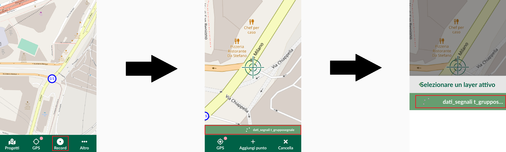
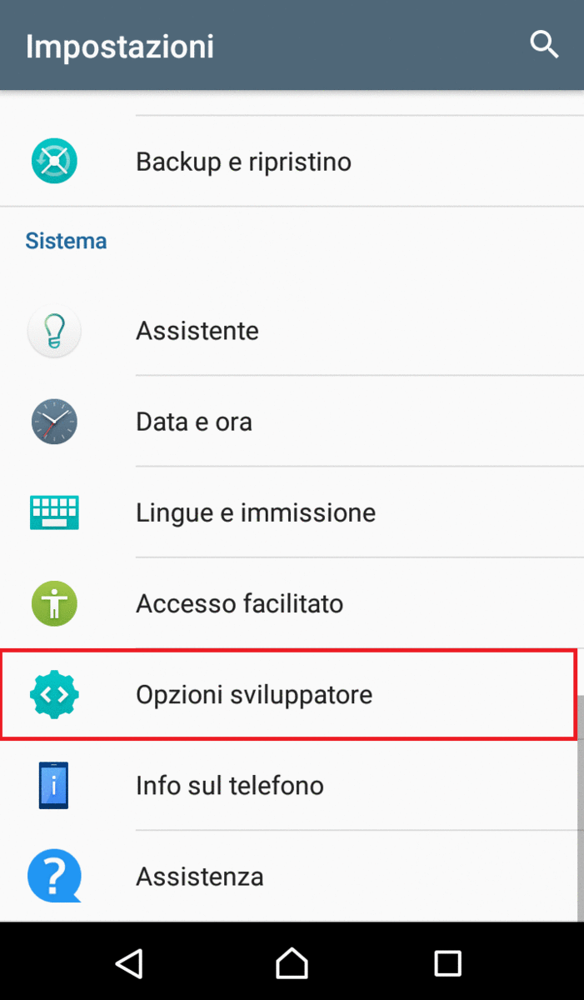
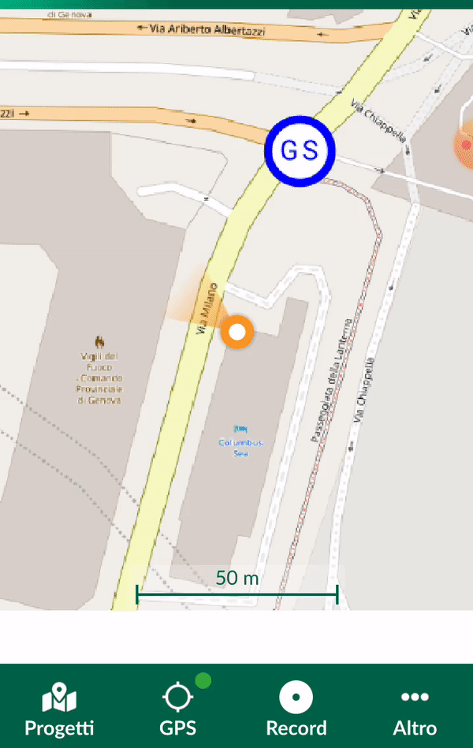

Input
==================================

.. figure:: img/logo_input.png
  :align: center
  :scale: 150
  :figclass: align-center

  Un GIS mobile app sviluppato da `Lutra Consulting <https://www.lutraconsulting.co.uk/>`__.

Installazione
----------------------------------

* Creare un account su https://public.cloudmergin.com/ (il account gratuito dà diritto a 100 MB di spazio di archiviazione)
* Scaricare l'applicazione sul mobile, disponibile su Google Play e App Store
* Installare il plugin mergin dal QGIS public repertory su QGIS Desktop

.. note:: È possibile che il plugin sia completamente installato dopo avere riavviare QGIS. Il plugin è utilizzabile solamente dal **Browser panel**

Funzionamento
-------------------------------------

Input pertanto utiliza il servizio d'archiviazione Cloud, Mergin, per la sincronizzazione dei dati tra QGIS e l'app.

* Creare il progetto QGIS con i layers (preferisce il Geopackage), i stili, il form, ...

.. note:: Il sistema di coordinate di riferimento del progetto per usare il GPS deve essere il WGS84/Pseudo-Mercator (EPSG:3857). In caso contrario, la mappa è centrata alle coordinate predefinite, ad esempio al punto (0,0) nel sistema WGS84 (EPSG:4326).

* Configurare il plugin nel **Browser panel** con gli impostazioni dell'account

.. image:: img/mergin_plugin_init.JPG
    :align: center

* Creare un nuovo progetto Mergin (possibilità di creare da un directory locale o un progetto vuoto)
* Mergin va sincronizzando il progetto Mergin con il progetto locale
* Connettersi all'account sull'applicazione Input
* Il progetto è disponibile sull'app, nella sezione *I miei progetti*
* Scaricare il progetto sul telefono.

* Aprire questo progetto nel *Home* page

.. note:: Quando c'è una modifica sul telefono o una sincronizzazione sul Desktop, lo statuto cambia nella pagina dell'origine del progetto (*I miei progetti*, *Condivisi*) con una pittogramma di sincronizzazione.

Funzionalità
+++++++++++++++++++++

* Aggiungere un'entità ad un layer selezionato
* Modificare della geometria e degli attributi non geografici di un'entità
* Identificazione di un'entità geografica

* Posizionamento di un punto con il GPS
* Tracciare linee o poligoni monitorando la posizione GPS

.. hint:: La selezione di un layer viene eseguita in modo diverso rispetto a QGIS o QField.

GPS
------------------------------------

L'applicazione usa per impostazione predefinita il GPS integrato al telefono. Però, è possibile di cambiare l'applicazione GPS.

Passo 1 : Divenire un sviluppatore
++++++++++++++++++++++++++++++++++++

.. image:: img/become_dev.gif
  :scale: 50

* Negli **Impostazioni**, aprire *Info sur telefono* alla fine della pagina.
* Cliccare tre o sette volte su il *Numero build*. Questo dipende del modello di telefono

Passo 2 : Cambiare l'app di posizione
++++++++++++++++++++++++++++++++++++++

* Negli **Impostazioni**, aprire la nuova sezione *Opzioni sviluppatore*
* Nel gruppo *Debug*, selezionare l'opzione *Seleziona app di posizione fittizia*
* Scegliere l'app connesso al ricevitore GPS esterno

Passo 3 : Usare Input
+++++++++++++++++++++++++++++++++++++

Vantaggi e svantaggi
----------------------------------

.. raw:: html

    
    <table style="border: 1px solid #000000;">
        <tr style="text-align:center;"><th>Vantaggi</th><th>Svantaggi</th></tr>
        <tr>
        <td><ul>
        <li>Rilievo offline possibile</li>
        <li>Sincronizzazione abbastanza veloce tra il rilievo e il progetto Desktop e molto veloce senza immagini</li>
        </ul></td>
        <td><ul>
        <li>Il vincolo *not null* non funziona sull'app, tranne i campi auto generati</li>
        <li>Non supporta i relazioni 1->n</li>
        <li>La modifica dei layers non geografici non è sviluppata</li>
        <li>I percorsi degli attaccamenti, per esempio gli immagini, non cambiano dopo sincronizzazione sul computer</li>
        <li>No checkbox (è sostituito da un switch e un text area con il valore scelto)</li>
        </ul></td>
    </tr></table>

I link utili
------------------------------

#. https://inputapp.io/
#. https://github.com/lutraconsulting/input/blob/master/docs/users/introduction.md
#. https://github.com/lutraconsulting/input/blob/master/docs/developers/manual_test_plan.md
#. https://www.lutraconsulting.co.uk/blog/2020/02/14/survey-qgis-input/
#. https://public.cloudmergin.com/ 
