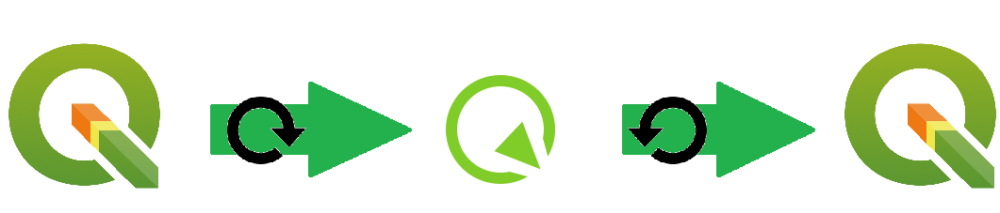

QField
==================================

Un mobile GIS app con gli obiettivi di accedere ai QGIS strumenti necessari sul terrano.

Installazione
----------------------------------

QField è un app per Android sistemi. 
L'ultima versione è disponibile a questo `link <https://github.com/opengisch/QField/releases/>`__ o su Google Play.

L'app usa un progetto QGIS esistente. Per vedere ed modificare dati, bisogna di:

#. Creare il progetto su QGIS Desktop
#. Creare o aggiungere i layers, le style, etc...
#. Esportare il progetto per l'app con il plugin `QFieldSync <https://plugins.qgis.org/plugins/qfieldsync/>`__
#. Copiare il progetto QField sul mobile

.. warning:: Il progetto deve essere nel **Internal storage** (non in una scheda SD esterna) per modificare i dati. Deve convertire la scheda vuota nella memoria interna.

.. hint:: Sceglie il Geopackage agli altri formati per i raster affinché il caricamento sia più veloce.

Funzionamento
----------------------------------

Il plugin QFieldSync permette il collegamento tra QField e QGIS tramite esportazione / imortazione.

Funzionalità
+++++++++++++++++++++

* Aggiunta un'entità a un layer selezionato
* Modifica della geometria e degli attributi non geografici di un'entità
* Identificazione un'entità (geografica o no)
* Posizionamento di un punto con il GPS
* Tracciare linee o poligoni monitorando la posizione GPS

Vantaggi e svantaggi
-----------------------------------

.. raw:: html

    
    <table style="border: 1px solid #000000;">
        <tr style="text-align:center;"><th>Vantaggi</th><th>Svantaggi</th></tr>
        <tr>
        <td><ul>
        <li>Personnalizzazione del modulo degli attributi con QGIS Desktop</li>
        <li>Memoria locale sul telefono - Manovrabilità con il GDPR</li> 
        <li>I vincoli degli attributi sono rispettati</li>
        </ul></td>
        <td><ul>
        <li>Durante la modifica, con il GPS spento, la disattivazione della visualizzazione delle coordinate tieniti sullo schermo i valori <i>Infinity</i> per X e Y.</li>
        </ul></td>
    </tr></table>

I link utiliti
--------------------------------------

#. https://qfield.org/
#. https://github.com/opengisch/QField/
#. https://plugins.qgis.org/plugins/qfieldsync/