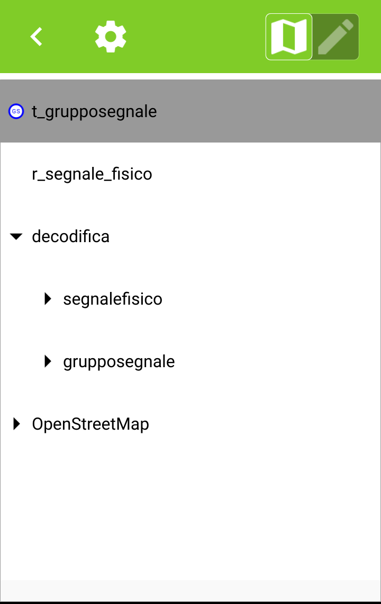

QField
==================================

.. figure:: img/logo_qfield.png
  :align: center
  :scale: 150
  :figclass: align-center

  Un mobile GIS app con gli obiettivi di accedere ai QGIS strumenti necessari sul terrano.

Installazione
----------------------------------

QField è un app per Android sistemi. L'app usa un progetto QGIS *esistente*. Per vedere e modificare dati, bisogna di:

#. Scarire ultima versione che è disponibile a questo `link <https://github.com/opengisch/QField/releases/>`__ o su Google Play.
#. Creare il progetto su QGIS Desktop
#. Creare o aggiungere i layers, i stili, il form, etc...
#. Esportare il progetto per l'app con il plugin `QFieldSync <https://plugins.qgis.org/plugins/qfieldsync/>`__
#. Copiare il progetto QField sul mobile

.. warning:: Il progetto deve essere nel *Archivio interno* (non in una scheda SD esterna) per modificare i dati. Altrimenti, deve convertire la scheda **vuota** nella memoria interna.

.. hint:: Sceglie il Geopackage agli altri formati di dati affinché il caricamento sia più veloce.

Funzionamento
----------------------------------

.. image:: img/qfield_funzionamento_generale.png

Il plugin QFieldSync permette il collegamento tra QField e QGIS tramite esportazione / importazione.

Funzionalità
+++++++++++++++++++++

* Aggiungere un'entità a un layer selezionato
* Modificare della geometria e degli attributi non geografici di un'entità

.. image:: img/qfield_modify_layer.gif
  :scale: 50

* Identificazione di un'entità (geografica o no con relazioni 1->n)
* Posizionamento di un punto con il GPS
* Tracciare linee o poligoni monitorando la posizione GPS
* Ricerca di un'entità con i suoi attributi
* Navigazione nei layers

* Visualizzazione dei logs

GPS
------------------------------------

L'applicazione usa per impostazione predefinita il GPS integrato al telefono. Però, è possibile di cambiare l'applicazione GPS.

Passo 1 : Divendere un sviluppatore
++++++++++++++++++++++++++++++++++++

* Negli **Impostazioni**, aprire *Info sur telefono* alla fine della pagina.
* Cliccare tre o sette volte su il *Numero build*. Questo dipende del modello di telefono

Passo 2 : Cambiare l'app di posizione
++++++++++++++++++++++++++++++++++++++

* Negli **Impostazioni**, aprire la nuova sezione *Opzioni sviluppatore*
* Nel gruppo *Debug*, selezionare l'opzione *Seleziona app di posizione fittizia*
* Scegliere l'app connesso al ricevitore GPS esterno

.. image:: img/change_gps_app.gif
  :scale: 50

Passo 3 : Usare QField
+++++++++++++++++++++++++++++++++++++

.. image:: img/qfield_w_gps.gif
  :scale: 50

Vantaggi e svantaggi
--------------------------------------

.. raw:: html

    
    <table style="border: 1px solid #000000;">
        <tr style="text-align:center;"><th>Vantaggi</th><th>Svantaggi</th></tr>
        <tr>
        <td><ul>
        <li>Conservazione della personnalizzazione del form, della simbologia di QGIS</li>
        <li>Memoria locale sul telefono - Manovrabilità con il GDPR</li> 
        <li>Conservazione dei vincoli sugli attributi</li>
        <li>Supporta i relazioni 1->n quando quando clé primaire parente est visibile</li>
        </ul></td>
        <td><ul>
        <li>Durante la modifica, con il GPS spento, la disattivazione della visualizzazione delle coordinate tieniti sullo schermo i valori <i>Infinity</i> per X e Y.</li>
        </ul></td>
    </tr></table>

""""""""""""""""""""""""""""""""""""""

I link utili
--------------------------------------

#. https://qfield.org/
#. https://github.com/opengisch/QField/
#. https://plugins.qgis.org/plugins/qfieldsync/