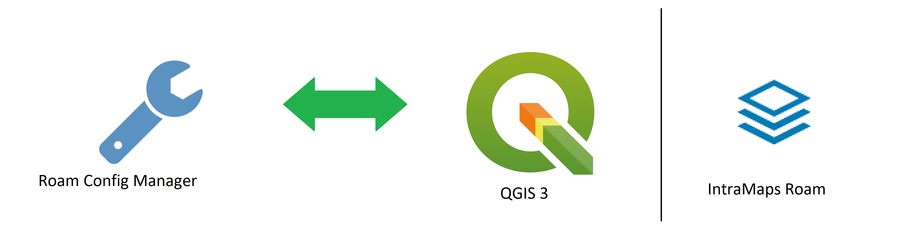
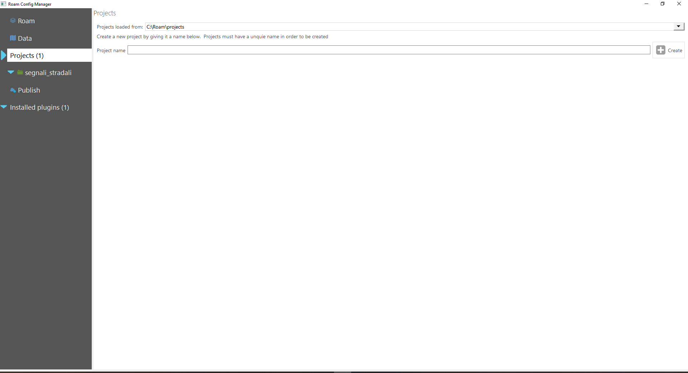
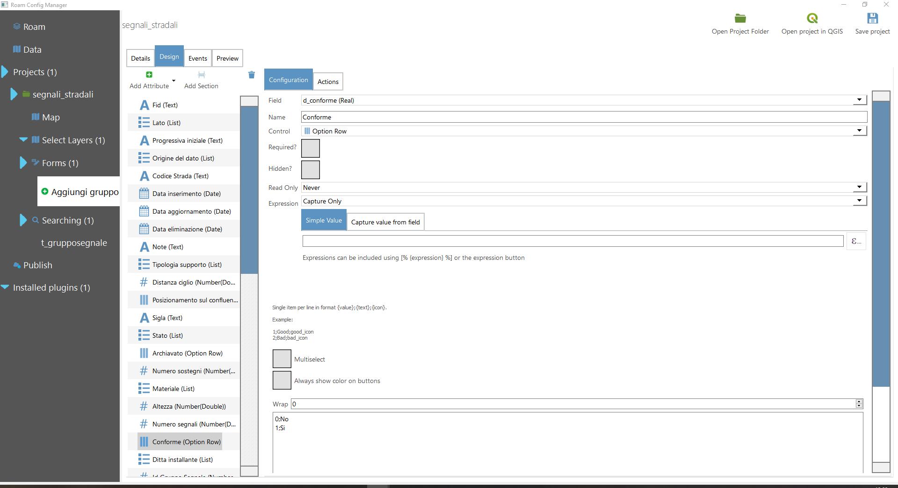
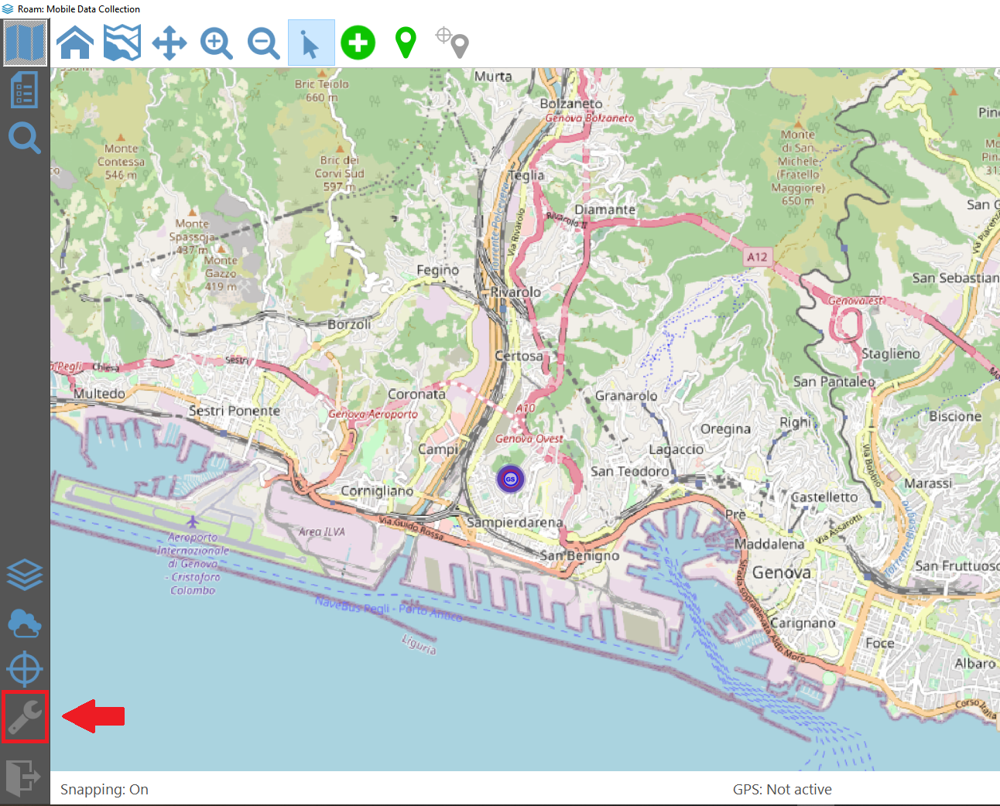

IntraMap Roam
==================================

IntraMaps Roam è un colletore di dati, sviluppato su Windows. Oggigiorno, non esiste una versione stabile dell'applicazione, disponibile su Windows e Linux.

Installazione
---------------------------------

L'applicazione può essere installata su Windows con un installatore o un pachetto binario precompilato (https://roam-docs.readthedocs.io/en/latest/).

.. warning:: L'app non funziona con i sistemi Windows RT.

Su Linux, l'app viene eseguita dalla sorgente.

Funzionamento
---------------------------------

L'applicazione Roam non interage direttamente con QGIS. Però, il gestore della configurazione comunica con il GIS.

* Creare un progetto con **Roam Config Manager.exe**

* Nel repertory creato da Roam, il repertory **_data** contiene i dati specifi del progetto
* Aprire il progetto in QGIS tramite l'intefaccia di **Roam Config Manager**
* Aggiungere i layers in QGIS
* Salvare il progetto in QGIS
* Nel **Roam Config Manager**, creare un nuovo form degli attributi nella sezione *Form*

.. note:: Il modulo è solamente per i layers geografici

* Nella scheda *Design*, configurare il tipo di campo di riempimento per ogni attributo
* Salvare il progetto e aprire **Roam.exe**
* Caricare lo da l'elenco dei progetti

.. warning:: Gli elenchi creati da un altro layer non funzionano per questa prova.

L'app offre la possibilità di pubblicare il progetto su un server web. Gli utenti possono scaricare il progetto su loro computer.

Funzionalità
+++++++++++++++++++++

* Aggiunta di un'entità a un layer selezionato
* Modifica della geometria e degli attributi non geografici di un'entità
* Identificazione un'entità

* Localizzazione GPS e acquisizione della posizione
* Form generato automaticamente
* Cercare un'entità secondo determini campi
* Monitorare la posizione GPS

GPS
++++++++++++++++++++

È possibile di collegare un GPS esterno all'applicazione su una **porta seriale** (per esempio, il connettore RS-232). Se l'applicazione è gia apperta, usa la pusanlte *Refresh List* negli opzioni (vede l'immagine sotto) e poi sceglie il GPS collegato.

Vantaggi e svantaggi
----------------------------------

.. raw:: html

    
    <table style="border: 1px solid #000000;">
        <tr style="text-align:center;"><th>Vantaggi</th><th>Svantaggi</th></tr>
        <tr>
        <td><ul>
        <li>Grande interfaccia</li>
        <li>Personalizzazione del form</li>
        <li>I vincoli funzionano</li>
        </ul></td>
        <td><ul>
        <li>App ancora in fase di sviluppo</li>
        <li>Non esiste per Android</li>
        <li>Nome del campo e non l'alias nel pannello informativo</li>
        </ul></td>
    </tr></table>

I link utili
----------------------------------

#. https://github.com/roam-qgis/Roam
#. https://roam-docs.readthedocs.io/en/latest/
